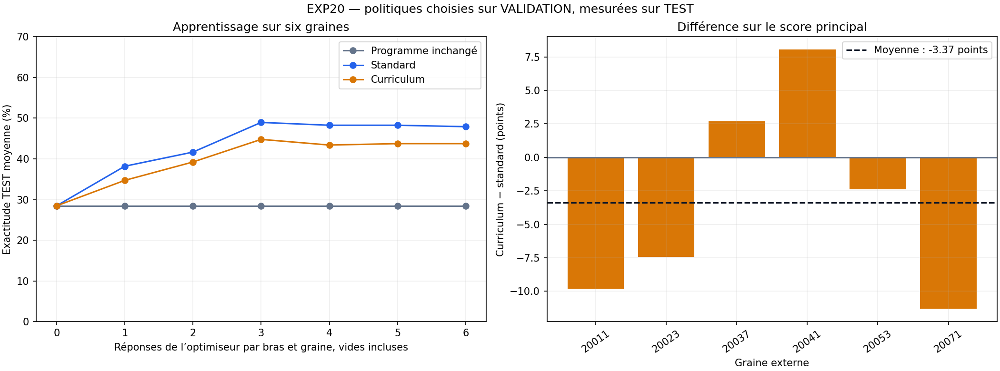

# EXP-20 — résultat complet avec Qwen, 23 septembre 2026

**La campagne entière est terminée : six graines, 72 réponses d’optimiseur,
tous les candidats sur 60 TRAIN + 24 VALIDATION, puis toutes les politiques
sélectionnées sur 48 TEST.** Le petit lecteur est
`qwen/qwen-2.5-7b-instruct` ; l’optimiseur est resté exactement
`deepseek/deepseek-v4-flash-0731`.

**Résultat : l’apprentissage améliore le programme initial sur les questions
TEST. Le curriculum échec→réussite n’a pas démontré d’avantage sur
l’apprentissage standard.** Cela ne prouve ni son inefficacité générale, ni
l’intérêt d’une profondeur récursive supplémentaire.

## Résultats à lire en premier

Le score principal est l’exactitude TEST moyenne des politiques choisies sur
VALIDATION après 0, 1, …, 6 réponses d’optimiseur. Il récompense un gain obtenu
tôt. L’exactitude finale, mesurée après les six réponses, est distincte.

| Procédure | Score principal moyen | Médiane entre graines | Exactitude TEST finale moyenne |
|---|---:|---:|---:|
| Programme inchangé | 28,47 % | 29,17 % | 28,47 % |
| Apprentissage standard | **43,11 %** | 43,60 % | **47,92 %** |
| Apprentissage avec curriculum | 39,73 % | 39,73 % | 43,75 % |

| Contraste sur le score principal | Différence moyenne | Intervalle bootstrap apparié à 95 % | Lecture enregistrée |
|---|---:|---:|---|
| Standard − inchangé | +14,63 points | [+11,41 ; +17,81] | Signal positif |
| Curriculum − inchangé | +11,26 points | [+8,13 ; +14,09] | Signal positif |
| **Curriculum − standard** | **−3,37 points** | **[−8,53 ; +2,38]** | **Inconclusif à cet effectif** |

Le F1 de réponse final, descriptif, suit la même direction : 38,39 % inchangé,
57,55 % standard, 53,18 % curriculum. Il ne remplace pas l’exact match principal.

Unité de réplication : la graine externe, **n=6**, et non chacune des 48 questions.
Bootstrap fixé avant exécution : 10 000 rééchantillonnages appariés, graine 20099.
Ces intervalles exploratoires sont fragiles à cet effectif et conditionnels à ce
panel de questions. Aucun bras n’atteint le seuil enregistré de 70 % : les temps
d’atteinte restent censurés, pas remplacés par un temps observé.



La courbe peut baisser : VALIDATION choisit parfois un nouveau programme qui
réussit moins bien sur TEST. On conserve cette baisse ; on ne sélectionne jamais
le meilleur point à partir de TEST.

| Graine | Inchangé, principal | Standard, principal | Curriculum, principal | Curriculum − standard |
|---|---:|---:|---:|---:|
| 20011 | 29,17 % | 43,75 % | 33,93 % | −9,82 points |
| 20023 | 27,08 % | 45,83 % | 38,39 % | −7,44 points |
| 20037 | 29,17 % | 40,77 % | 43,45 % | +2,68 points |
| 20041 | 29,17 % | 37,50 % | 45,54 % | +8,04 points |
| 20053 | 29,17 % | 43,45 % | 41,07 % | −2,38 points |
| 20071 | 27,08 % | 47,32 % | 36,01 % | −11,31 points |

Sources : [agrégats complets](results/run_store/full/confirmation/results.json),
[manifest gelé](results/run_store/full/confirmation/manifest.json),
[recalcul indépendant depuis les réponses brutes](results/run_store/full/confirmation/raw_recomputation.json).

## Ce qui a réellement appris, et les limites de l’attribution

Le module peut modifier du code de classement, une instruction texte, un entier
`top_k` et un booléen `bridge_expansion`. Le standard utilise des batchs de six
questions tirées du pool TRAIN. Le curriculum remplace jusqu’à deux places par
les derniers exemples précédemment échoués puis réussis après entraînement.
Le parent et la proposition sont comparés sur le même batch TRAIN courant.
VALIDATION intervient seulement après la génération pour choisir les politiques
à déployer, y compris celle de chaque préfixe.

Le curriculum a produit **33 transitions échec→réussite** et modifié les batchs
suivants. Chaque chaîne a réellement fourni au feedback **22 à 36 questions
TRAIN distinctes** ; le seuil de couverture de vingt est satisfait partout.
Cela écarte l’explication « buffer jamais alimenté ». Cela ne prouve pas que les
exemples retenus sont les plus instructifs : le standard couvre en moyenne
34 questions distinctes, le curriculum 27,17. Ce compromis diversité/répétition
est une piste descriptive, pas une cause isolée du delta observé.

**Huit des douze programmes finaux choisissent `top_k=10`.** Le gain peut venir
en partie de l’accès à davantage de documents et d’une meilleure instruction de
réponse. Le contrôle fixe « dix documents » a été exécuté avec Gemma dans le
pilote historique, **pas avec Qwen dans cette confirmation**. On ne peut donc
attribuer les +19,44 points finaux du standard au seul code de classement, au
feedback récursif ou à une invention algorithmique. Le programme initial ne
saturait pas ; cela ne garantit pas une amélioration au-delà de six propositions.

Le contraste porte sur **deux configurations d’apprentissage fixées à l’avance**.
Il teste un choix O1, pas une découverte automatique de configurations O1,
ni O2, ni amortissement, ni avantage sur une génération indépendante sans feedback.
La tâche documentaire n’est pas une optimisation de matrices ou une recherche
scientifique ouverte de long horizon. Les traces restent celles décrites au §4 ;
aucune comparaison OTEL/sysmon/hybrid n’est ajoutée après avoir vu TEST.

**Prochaine comparaison ciblée, non exécutée :** sur de nouvelles questions,
comparer le programme initial à `top_k=10`, puis à ce même programme avec une
instruction courte figée, avant d’attribuer le gain aux autres surfaces. Pour le
curriculum, isoler ensuite la règle de sélection de mémoire à budget et nombre
de questions fraîches contrôlés. Aucun gain de ces interventions n’est garanti.

## Couverture, invalidité, coût et artefacts réutilisables

| Mesure | Standard | Curriculum |
|---|---:|---:|
| Réponses d’optimiseur, toutes conservées | 36 | 36 |
| Réponses vides | 2 | 2 |
| Réponses terminées par `length` | 2 | 3 |
| Artefacts générés distincts | 32 | 32 |
| Artefacts générés éligibles | 30 | 31 |
| Évaluations TRAIN invalides pendant l’apprentissage | 12 | 6 |
| Évaluations d’apprentissage réelles / allouées | 1 020 / 1 044 | 1 020 / 1 044 |
| Tokens d’optimiseur réels | 1 961 798 | 1 957 022 |
| Coût d’optimiseur rapporté | 0,956281 USD | 0,980358 USD |

Les sorties vides et tronquées consomment les slots et ne sont pas remplacées.
Les dénominateurs ci-dessus distinguent réponses et artefacts uniques. Trois
artefacts invalides restent exclus de la sélection, avec leurs **252 résultats
TRAIN/VALIDATION typés invalides** ; aucune précision fictive ne leur est imputée.
Les douze sélections finales sont des programmes générés. **Zéro fallback sur les
1 248 évaluations TEST**, toutes présentes. Le nombre est inférieur à
6×3×7×48 parce qu’un même programme sélectionné à plusieurs préfixes est évalué
une seule fois par graine, puis son résultat est réutilisé.

Au total : **9 168 évaluations de politique** (2 040 apprentissage,
5 880 éligibilité TRAIN/VALIDATION, 1 248 TEST). Parmi elles, 8 898 appels logiques
au lecteur : **6 988 réponses facturées et 1 910 cache hits**. Les allocations
inutilisées ne financent aucune proposition supplémentaire.

| Rôle | Réponses et tentatives réelles | Tokens entrée | Tokens sortie | Total tokens | Coût rapporté |
|---|---:|---:|---:|---:|---:|
| Lecteur Qwen | 6 988 | 9 019 385 | 49 234 | 9 068 619 | 0,911785 USD |
| Optimiseur DeepSeek | 72 | 3 355 552 | 563 268 | 3 918 820 | 1,936639 USD |
| **Campagne principale** | **7 060** | **12 374 937** | **612 502** | **12 987 439** | **2,848424 USD** |

Aucun retry de transport ni appel principal non réconcilié. Fournisseurs observés :
Phala pour le lecteur ; Baidu 66 / Cohere 6 pour l’optimiseur, répartis 33/3 dans
chaque bras. Les appels de pilote, et la facturation inconnue de l’appel de pilote
interrompu, sont séparés de ce total. Le délai réseau configuré n’est pas une
borne ferme sur la durée totale d’un appel.

Les [courbes de coût descriptives](results/run_store/full/confirmation/cost_curves.png) et
[leurs données](results/run_store/full/confirmation/cost_curves.json) reconstituent la dépense
**partagée des deux bras et six graines**, par préfixe, avec les reçus réels
comptés une fois. Elles incluent apprentissage et sélection, excluent mesure
TEST et pilotes. Ce n’est ni une nouvelle métrique principale, ni le coût
contrefactuel d’un bras exécuté seul ; VALIDATION était réellement différée.

Les [douze sources sélectionnées et leurs hashes](results/run_store/full/confirmation/diagnostics.json)
sont disponibles. Le représentant curriculum a été choisi **avant TEST** : graine
20041, proposition 2, hash canonique
`b464b9abd8c922fb7b490a18c20d4f5d077f8f51ae7b5e568b479233015a1c62`.
Son [artefact exact](results/run_store/full/confirmation/chains/20041/curriculum/artifacts/b464b9abd8c922fb7b490a18c20d4f5d077f8f51ae7b5e568b479233015a1c62.json)
classe les documents par recouvrement pondéré de mots, fournit les dix documents,
désactive l’expansion et demande une réponse courte `FINAL:`, avec le nom complet
pour une personne. Le hash du fichier JSON est distinct du hash canonique de ses
paramètres ; tous deux figurent dans le diagnostic. Aucun candidat n’a été réparé
manuellement.

## Modifications prospectives et vérification finale

Le premier pilote Gemma ci-dessous est conservé, gates échouées comprises.
L’utilisateur a explicitement autorisé la poursuite complète puis le changement
vers Qwen : [autorisation](results/run_store/full/authorization.json),
[amendement du lecteur](results/run_store/full/qwen_reader_amendment.json).
Un pilote Qwen a été interrompu après un appel sans réponse pendant plus de onze
minutes ; son état distant et sa facturation sont inconnus, pas imputés à zéro.
Le routage DeepSeek a ensuite été fixé symétriquement à
`extra_body.provider.sort="throughput"`, modèle et décodage inchangés :
[amendement](results/run_store/full/qwen_routing_amendment.json).

Le second pilote a exécuté les deux bras et les transitions curriculum. Il a
révélé un défaut de cache : l’étiquette cosmétique `profile=reader` séparait deux
requêtes identiques. Les 64 réponses répétées restent conservées. Correction
avant confirmation, test de régression et contrôle réel d’une réponse facturée
pour deux appels logiques : [amendement](results/run_store/full/cache_identity_amendment.json),
[preuve](results/run_store/full/cache_integration_check/result.json).
Le validateur du Control Plane accepte désormais uniquement le champ OpenRouter
`provider.sort` et ses valeurs déclarées, sans ouvrir les substitutions de modèle
ou de credentials. Toutes ces corrections précèdent le gel principal.

Six processus, un par graine, ont exécuté les deux bras dans un ordre alterné.
La campagne principale a duré **25,18 minutes** entre la première requête et la
dernière réponse, hors pilotes, préparation et vérification finale.
Toutes les sélections ont été gelées à **14:51:54 UTC**, avant tout TEST.
Le [précontrôle](results/run_store/full/confirmation/preflight.json) et les archives de sources
permettent de vérifier le code effectivement utilisé. **276 tests passent**, zéro
skip, un avertissement de dépréciation optionnelle LangGraph ; Black, Ruff et
`git diff --check` passent pour les modifications. La suite globale du dépôt n’a
pas été exécutée. Le [contrôle final détaillé](results/run_store/full/confirmation/verification.json)
distingue les changements de cette tâche du travail utilisateur déjà présent.
Aucun commit, push, PR, changement de dépendance ou message à Patrick.

Le [recalcul brut](results/run_store/full/confirmation/raw_recomputation.json) vérifie les
7 128 résultats d’évaluation externe, les 72 réponses, les hashes des sources,
le gel avant TEST et les agrégats appariés. Les tests vérifient séparément
l’isolation de VALIDATION vis-à-vis de la génération. Les échecs et deltas défavorables restent dans l’analyse.
Recalcul **sans appel de modèle**, depuis la racine du dépôt :

```bash
PYTHONPATH=. /home/xav/miniconda3/envs/humanllm/bin/python artifacts/o1_learning/exp20/full/confirmation/recompute_from_raw.py
/home/xav/miniconda3/envs/humanllm/bin/python artifacts/o1_learning/exp20/full/confirmation/presentation.py
```

Les sections suivantes expliquent le choix de tâche et conservent les résultats
du premier pilote. Les anciens fichiers `exp20/full/status.json` et
`exp20/full/verification.json` décrivent le blocage Gemma **historique**, pas l’état
final. Ne pas relancer les slots terminés pour remplacer leurs résultats.

## Qualification historique — résultat préservé

**Exécution du 23 septembre 2026 : 96/96 réponses du pilote obtenues, deux gates
non satisfaites. À cette étape historique, le pilote d’apprentissage et la confirmation n’avaient pas été lancés.**
Ce n’est pas un résultat négatif sur le curriculum : aucun appel d’optimiseur,
aucune transition d’apprentissage et aucune évaluation TEST n’ont eu lieu.

| Condition sur les mêmes 24 questions | Réponses exactes | Exactitude | F1 moyen |
|---|---:|---:|---:|
| Programme initial, quatre documents | 7/24 | 29,17 % | 40,28 % |
| Répétition indépendante du programme initial | 6/24 | 25,00 % | 36,46 % |
| Dix documents | 5/24 | 20,83 % | 32,17 % |
| Deux documents pertinents fournis — diagnostic privilégié | 8/24 | 33,33 % | 49,43 % |

**Pourquoi le premier lancement s’était-il arrêté ici ?** Le protocole exigeait au moins 12/24 réponses exactes
avec les documents pertinents : on en observe 8. Il exigeait aussi au moins trois
échecs initiaux résolus dans cette condition : on en observe deux. Les quatre
autres gates passent : pas de saturation, format exploitable sur 96/96 sorties,
un seul changement correct/incorrect à la répétition. Les seuils et scores restent
inchangés. Ces observations sur 24 questions ne prouvent pas une incapacité
générale du lecteur ni un effet négatif de fournir davantage de documents.

**Le nombre de tokens n’explique pas cet échec mesuré.** Les 96 réponses finissent
par `stop`, jamais par `length`, et utilisent au plus 39 tokens sur 192 autorisés.
Le plafond DeepSeek de 16 000 tokens n’a pas été exercé.

**Une cause visible est la forme de la réponse.** À la question sur l’université
du biographe de John Clare, le lecteur donne une phrase contenant « University of
Oxford » ; l’exact match attend seulement ce nom. Sur la comparaison des canaux,
il identifie correctement Tennessee–Tombigbee mais ajoute une explication. Ces
sorties respectent `FINAL:` mais échouent à l’exact match. D’autres cas sont de
vraies erreurs de raisonnement : avec les documents pertinents, le modèle choisit
Mirosław Hermaszewski comme né avant Ulf Merbold, à tort. Enfin certains libellés
attendus sont discutables ou très spécifiques : « He was a mathematician » face
à « Mathematics », ou « Ahmad » face à « Ahmad Nahavandi ». Il serait abusif de
réduire tous les échecs à la compétence du lecteur. **Aucun cas n’a été rescorré
manuellement.** Le F1 est descriptif et ne remplace pas la gate d’exact match.

**Proposition historique, non exécutée sous Gemma :** un diagnostic séparé de l’instruction
de réponse, à modèle/ranker/budgets constants, demandant explicitement une entité,
une date ou `yes/no`, sans phrase. Le comparer à l’instruction actuelle sur des
questions de pilote nouvelles. Il doit distinguer les gains de restitution des
gains de retrieval/raisonnement, sans assouplir le score après coup. Changer le
lecteur et le prompt simultanément empêcherait ce diagnostic. Si ce diagnostic
qualifie la tâche, reprendre ensuite le pilote d’intégration, puis le three-way
sur les 60 questions TRAIN prévu ci-dessous. Aucun gain n’est garanti.

**Incident et coût :** le premier passage a épuisé 192 tentatives de transport
sans réponse archivée ; le journal révèle des HTTP 429 DeepInfra. Après un contrôle
isolé réussi, une reprise bornée a obtenu les 96 réponses, avec dix retries.
Les premières tentatives sont conservées, pas effacées. Au total : **97 réponses
complétées** (96 scientifiques + 1 disponibilité), **299 tentatives comptabilisées**,
**80 119 tokens**, **0,00407705 USD de coût rapporté**. Les erreurs du premier
passage ne fournissent pas de reçu individuel : une facturation distante non
rapportée ne peut pas être exclue. Le fournisseur est DeepInfra pour les 96
réponses scientifiques. Aucun modèle n’a été remplacé.

Le lanceur a été corrigé avec tests : arrêt après une vague défaillante au lieu
de soumettre toutes les requêtes malgré la panne, et archivage d’erreurs à champs
sanitisés. L’amendement change seulement l’orchestration et les diagnostics ;
modèle, questions, métriques et gates restent identiques. La reprise utilise un
manifest distinct. Les sources et le manifest initiaux sont sauvegardés.

Preuves : [résumé immuable](results/run_store/pilot_recovery/summary.json),
[recalcul depuis les réponses brutes](results/run_store/raw_audit.json),
[amendement et réconciliation](results/run_store/pilot_recovery_amendment.json),
[bilan d’exécution](results/run_store/execution_report.json).
La poursuite autorisée avec Qwen est analysée en tête de ce document ; les scores
Gemma ne sont pas mélangés aux résultats principaux.

## 1. Ce que l’on conserve et corrige dans EXP-19

EXP-19 est un bon **instrument de diagnostic**, mais ne suffisait pas à comparer
largement les méthodes de méta-optimisation. Son TRAIN contenait déjà **24
exemples** : le problème était surtout qu’ils décrivaient seulement **24 bits**.
Augmenter le nombre d’expressions composées ne crée pas autant de compétences
indépendantes. Le plafond est structurel, même si certains apprentissages
n’arrivaient pas à l’atteindre.

On conserve le dict canonique, les paramètres Trace, les backends de capture,
les transitions curriculum échec→réussite, les budgets explicites et la séparation
apprentissage/sélection/test.

Correction minimale : le nouveau dict active
`trainer_kwargs.selection_score_window="latest_train_batch"`.
Le parent et la proposition sont comparés **sur les mêmes six questions TRAIN du
pas courant**. Les résultats d’anciens lots ne participent pas à cette comparaison.
Le trainer retire les anciens candidats de cette compétition locale ; l’historique
des observations du parent reste disponible. La sélection finale est une opération
distincte sur VALIDATION. L’option est volontairement limitée à un parent, une
proposition, un batch et un objectif scalaire ; une configuration incompatible
est rejetée. Le fonctionnement historique par défaut n’est pas modifié.

Cela **corrige une ambiguïté de mesure**, sans prouver que cette nouvelle règle
améliorera la performance. EXP19-S4 n’isolait pas un effet pur de la validation.
Ses résultats et ses limites restent dans [EXP19](../EXP19/RESULTS.md).

## 2. Pourquoi cette tâche plutôt qu’une autre ?

| Candidat examiné | Intérêt | Limite pour cet essai | Décision |
|---|---|---|---|
| Tables booléennes EXP19 | Vérifier le branchement, le coût et les transitions | 24 bits mémorisables ; surfaces très homogènes | Garder comme test logiciel |
| BBEH / PAL | Raisonnement symbolique, code et correction objective | Avec un petit résolveur, risque de plancher ; workflow à construire pour rendre plusieurs paramètres utiles | Bon autre axe, pas premier choix ici |
| FinQA | Documents, tableaux, calculs et programmes annotés | Extraction numérique et unités ajoutent un harness plus délicat ; ce n’est pas de l’optimisation de matrices | Réserve pour un second domaine |
| **HotpotQA distractor** | Documents explicites, questions de liaison/comparaison, faits justificatifs annotés | Benchmark public ancien ; dix documents seulement ; compétence réelle du petit lecteur à vérifier | **Choix exécuté** |

Cette sélection repose sur l’adéquation au mécanisme à étudier, **pas sur un
classement empirique des gains O1 entre datasets**. Les quatre datasets n’ont pas
fait l’objet d’une campagne comparative.

Sources primaires : [description et données HotpotQA](https://hotpotqa.github.io/),
[BBEH et son évaluation](https://github.com/google-deepmind/bbeh),
[FinQA et ses corrections documentées](https://github.com/czyssrs/FinQA).

## 3. La tâche concrète et ses quatre surfaces

Exemple **inventé pour expliquer le mécanisme** : « Où est née l’autrice du Livre
rouge ? » Un document identifie l’autrice ; un autre donne son lieu de naissance ;
huit autres documents sont des distracteurs. Il faut trouver les deux informations
et les relier. Les questions de comparaison demandent par exemple de comparer
les dates concernant deux personnes.

```text
Question + 10 documents
  → code de classement
  → éventuellement enrichir la recherche avec le premier document et reclasser
  → garder k documents
  → instruction + contexte vers le petit lecteur (un seul appel)
  → réponse courte → correction par l’évaluateur
```

| Paramètre optimisé | Type réel | Effet | Départ / limites |
|---|---|---|---|
| `ranker_source` | Code Python stocké dans un paramètre texte | Ordre des documents ; peut apprendre une autre stratégie lexicale | Chevauchement de mots ; `rank(question, passages)` ; 12 000 caractères max ; aucun I/O/import |
| `answer_instruction` | `str` | Comment le lecteur combine et restitue les faits | Instruction courte raisonnable ; 4 000 caractères max |
| `top_k` | `int` | Nombre de documents remis au lecteur | 4 ; valeurs 2 à 10 |
| `bridge_expansion` | `bool` | Activer une deuxième recherche avec le premier document | False ; ajoute au plus 1 600 caractères au query de retrieval ; aucun appel LLM supplémentaire |

Le code est réellement exécuté dans un sous-processus frais : ce n’est pas une
autre chaîne d’instructions. Il peut seulement renvoyer une permutation des
documents. Timeout dur de deux secondes, environnement sans clé, restrictions
AST et limites de ressources. **Ce dispositif n’est pas un sandbox de sécurité
du système d’exploitation.** Le reader et le ranker ne reçoivent ni réponse
attendue, ni annotation de soutien, ni identité de split.

Le lecteur de la campagne amendée est **`qwen/qwen-2.5-7b-instruct`**, un modèle 7B,
température 0, 192 tokens de sortie, sans outils ni appel de critique. Il remplace
Gemma 3 4B à la demande explicite de l’utilisateur après la panne amont ; les
premières réponses réelles Qwen ont été reçues via Phala. L’optimiseur reste
**DeepSeek v4 Flash 0731**, température 0,6, 16 000 tokens, reasoning low.
Le pilote Gemma antérieur reste séparé des résultats Qwen.

Les types natifs et leur passage par OptoPrime sont testés. OptoPrime conserve son
parsing/conversion standard, y compris le formatage automatique du code : **la réponse brute et l’artefact effectivement évalué sont tous deux archivés**,
sans les confondre ni réparer manuellement le candidat.

## 4. Exemples, batch, curriculum et trace sont des choses différentes

| Ensemble | Nombre | Utilisation |
|---|---:|---|
| Pilote de qualification | 24 | Capacité du lecteur, variabilité, documents pertinents, coût |
| TRAIN du pilote d’intégration | 24 | Vérifier ensuite deux mises à jour par bras |
| Sélection du pilote d’intégration | 24 | Contrôle séparé du pilote, jamais résultats confirmatoires |
| TRAIN de la comparaison | **60** | Pool des problèmes d’apprentissage |
| VALIDATION | 24 | Sélection des candidats après les apprentissages |
| TEST | 48 | Comparaison finale, après gel de toutes les sélections |

Chaque ensemble contient autant de questions « liaison » que « comparaison ».
Les IDs, questions normalisées et paires de titres justificatifs sont disjoints.
Les articles individuels peuvent se retrouver entre ensembles : ce n’est pas un
test de transfert à des documents entièrement nouveaux. Tous proviennent du
**dev public** d’HotpotQA, repartitionné et épinglé par révision/hash ; notre TEST
n’est pas le test officiel caché. Une contamination par le préentraînement des
modèles reste possible.

**Batch ≠ pool :** six questions vues à une mise à jour ; dans le bras curriculum,
au plus deux proviennent de la mémoire des **échecs devenus réussites après
entraînement**, le reste du pool initial. Les exemples toujours échoués ne sont
pas présentés comme réussites apprises. Les événements `add_success_after_fail`
et les indices du batch suivant sont archivés dans les preuves.

Un lecteur stochastique pourrait réussir par chance sans progrès du programme.
Le pilote répète donc les mêmes requêtes sans cache pour mesurer ce risque.
Pour la campagne principale, le cache est figé par requête exacte, modèle,
paramètres et graine externe, partagé entre bras : une requête inchangée conserve
sa réponse. Les appels logiques, cache hits et appels facturés sont publiés ci-dessus.
**Le cache partagé est désormais implémenté et testé dans le lanceur complet.**
Il est distinct de la simple reprise des slots du pilote. Sa vérification réelle avec Qwen est passée avant la confirmation.

Les étapes ont de vrais nœuds `rank_passages`, `expand_query`, `select_context`,
`make_prompt`, `_record_call`, `pack_answer`. Le dict commence avec `internal`,
`detail=full`, `credit_horizon=full`, 24 nœuds et 6 000 caractères maximum.
La capture interne existante résume les valeurs à 80 caractères par nœud ; les
requêtes/réponses exactes du pilote sont aussi sauvegardées. OTEL/sysmon/hybrid
restent des alternatives configurables, pas des traitements simultanément ajoutés
au premier test de curriculum. Sysmon ne voit pas l’intérieur du sous-processus.
Ici, **credit_horizon est une fenêtre de projection locale**, pas une attribution
causale à travers plusieurs épisodes.

## 5. Gates du pilote initial, conservées malgré la poursuite autorisée

Pour les mêmes 24 questions, quatre conditions fixées avant tout appel :

1. Le programme initial avec quatre documents.
2. Une répétition indépendante exacte de cette condition.
3. Les dix documents, sans autre changement : contrôle d’une amélioration triviale
   obtenue simplement en augmentant `top_k`.
4. Les deux documents annotés pertinents : **diagnostic privilégié**, jamais
   candidat ni solution autorisée. Il isole la capacité du lecteur à utiliser
   l’information si elle était bien retrouvée.

Gates du pilote : exactitude initiale et du contrôle dix documents ≤85 %, exactitude avec documents pertinents
≥50 %, au moins trois échecs initiaux résolus avec ces documents, ≤10 % de sorties
au format invalide et au plus deux changements correct/incorrect entre répétitions.
Ce sont des seuils d’ingénierie sur un petit échantillon, pas des preuves de gain.
Même si ces gates passent, on inspectera le contrôle « dix documents » : si ce
simple paramètre suffit à saturer, le programme O1 n’est pas justifié en l’état.
Le script ne lance donc **jamais automatiquement la confirmation**.

**Déjà mesuré hors ligne :** le classement lexical de départ place les deux
documents requis dans son top-4 sur **5/24 questions** ; rappel moyen des documents
justificatifs **52,08 %**. C’est un diagnostic de retrieval, **pas une exactitude
du lecteur, ni un gain projeté de curriculum**. Voir [preuves](../_shared/o1_learning/exp20_preflight.json).

