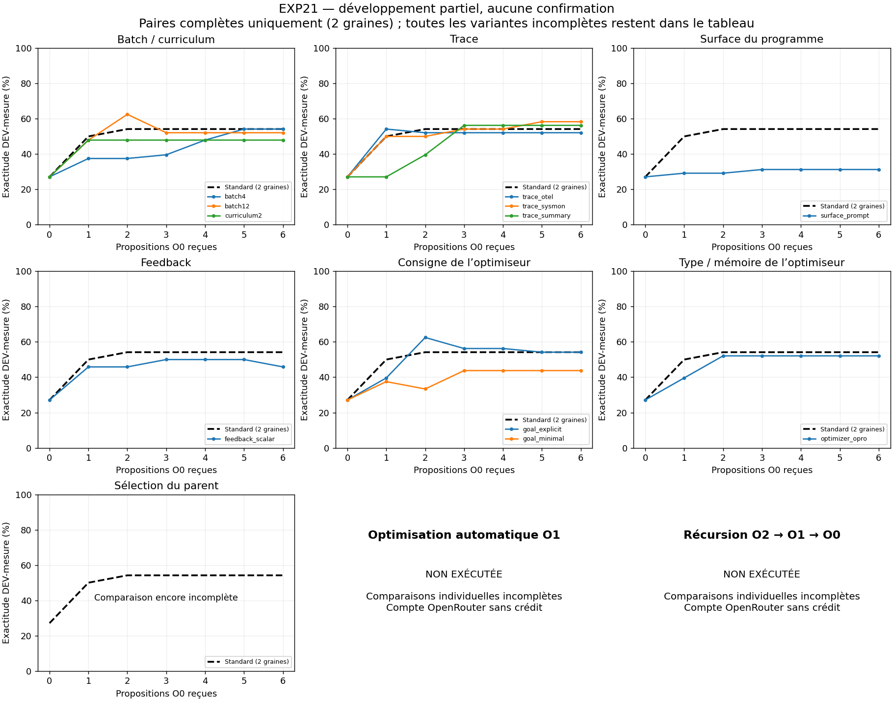

# EXP-21 — huit axes et optimisation automatique de l’optimiseur

**Campagne incomplète : le compte OpenRouter est sans crédit.** Les travaux locaux sont terminés et vérifiés. Aucun worker n’est actif. O1/O2 et confirmation n’ont pas été exécutés.

## État au 24 septembre 2026

| Étape | État |
|---|---|
| Comparaisons individuelles, axes 1–7 | **219/252 réponses ; 33/42 chaînes entièrement mesurées** |
| Cinq chaînes interrompues | Réponses et évaluations partielles conservées ; cinq refus lecteur HTTP 402 |
| Quatre chaînes inédites | Aucun appel émis |
| Combinaisons / ablations | Attend les 42 mesures ; aucun gagnant choisi sur le sous-ensemble disponible |
| Optimisation automatique O1 / récursion O2 | Implémentées et testées hors ligne ; aucune exécution réelle |
| Confirmation | Non commencée ; TEST fermé |

Cette continuation a ajouté **99 réponses DeepSeek, 4 121 réponses Qwen et 13 chaînes entièrement mesurées**, pour **2,381689 USD rapportés**. Aucun ancien essai n’a été remplacé.

## Le blocage exact

L’API du compte rapporte **140 USD crédités et 140,364179 USD consommés**, soit **−0,364179 USD**. La clé est plafonnée à **14 USD**, dont **13,375523 USD utilisés** : sa marge de **0,624477 USD** ne constitue pas du crédit disponible sur le compte. Ces montants globaux ne sont pas le coût d’EXP21. [Preuve API horodatée](results/run_store/provider_credit_402.json).

La [documentation OpenRouter](https://openrouter.ai/docs/api_reference/errors-and-debugging) distingue les refus de requête pour crédit insuffisant des erreurs après le début d’une génération. Les cinq HTTP 402 sont conservés, sans réponse reçue. L’ancien enregistreur les marquait prudemment « uncertain » ; ces fichiers restent intacts et leur réconciliation est documentée séparément.

**Pour terminer, il faut alimenter le compte et relever la limite de la clé.** Le scénario maximal restant représente 645 réponses d’optimiseur, environ 14.87 USD au coût moyen observé, plus Qwen. Une recharge de 25 USD et un plafond total de clé de 40 USD donnent une marge à ce débit de coût ; ce sont des estimations, pas une dépense cible. Aucun budget scientifique n’est réduit.

## Résultats de développement disponibles

Le standard apprend le programme (O0) avec des réglages fixes. Les variantes changent un axe de ces réglages. O1 doit ensuite apprendre les réglages eux-mêmes ; il n’a pas encore été exécuté réellement.

Chaque cellule indique **moyenne de progression / exactitude finale**, en pourcentage, sur les 24 questions DEV-mesure. La progression moyenne couvre les préfixes 0…6, choisis sur DEV-sélection. Un delta n’est calculé que si les deux graines sont complètes, sans imputer les cases manquantes. **n=2, développement : aucun résultat confirmatoire.**

| Axe | Configuration | 21011 | 21023 | Delta moyen vs standard, points (2 graines) |
|---|---|---:|---:|---:|
| baseline | `standard` | 53.57 / 58.33 | 45.83 / 50.00 | +0.00 |
| batch | `batch4` | 35.71 / 54.17 | 49.40 / 54.17 | -7.14 |
| batch | `batch12` | 45.83 / 54.17 | 52.98 / 50.00 | -0.30 |
| batch | `curriculum1` | — | 54.17 / 58.33 | — |
| batch | `curriculum2` | 39.29 / 41.67 | 50.60 / 54.17 | -4.76 |
| trace | `trace_otel` | 43.45 / 45.83 | 54.17 / 58.33 | -0.89 |
| trace | `trace_sysmon` | 50.00 / 54.17 | 50.60 / 62.50 | +0.60 |
| trace | `trace_hybrid` | 39.88 / 45.83 | — | — |
| trace | `trace_summary` | 44.05 / 58.33 | 47.02 / 54.17 | -4.17 |
| trace | `trace_step` | 44.64 / 50.00 | — | — |
| surface | `surface_code` | — | 30.36 / 25.00 | — |
| surface | `surface_prompt` | 27.38 / 29.17 | 32.74 / 33.33 | -19.64 |
| surface | `surface_knobs` | — | 29.17 / 29.17 | — |
| surface | `surface_knobs_then_all` | 44.05 / 58.33 | — | — |
| feedback | `feedback_scalar` | 39.29 / 41.67 | 50.60 / 50.00 | -4.76 |
| feedback | `feedback_compact` | — | 38.69 / 41.67 | — |
| goal | `goal_explicit` | 54.17 / 58.33 | 45.83 / 50.00 | +0.30 |
| goal | `goal_minimal` | 36.90 / 45.83 | 41.07 / 41.67 | -10.71 |
| optimizer | `optimizer_opro` | 42.86 / 50.00 | 50.60 / 54.17 | -2.98 |
| optimizer | `optimizer_memory3` | 50.00 / 54.17 | — | — |
| trainer | `trainer_latest` | — | 47.02 / 50.00 | — |

Les résultats du standard sont désormais disponibles sur les deux graines. Le programme inchangé vaut 25,00 % / 29,17 %, soit 27,08 % en moyenne. Les diminutions de performance restent dans les courbes ; aucun meilleur préfixe n’est choisi après observation de DEV-mesure.


## Ce qu’on peut en tirer maintenant

Le programme inchangé obtient 27,08 % ; le standard atteint **49,70 % de progression moyenne et 54,17 % d’exactitude finale**. Cela décrit une amélioration par l’apprentissage O0 sur développement. Le standard n’optimise pas automatiquement ses propres réglages.

Parmi les variantes entièrement appariées, sysmon vaut **+0,60 point**, la consigne explicite **+0,30**, batch 12 **−0,30**, OPRO **−2,98**, curriculum mémoire 2 **−4,76** et instruction seule **−19,64** par rapport au standard. À deux graines de développement, les petits deltas ne démontrent pas un gain reproductible. Les mécanismes incomplets ne sont pas déclarés invalidés.



## Ce qui reste exactement

| Configuration | Graine | Réponses reçues / 6 | Travail restant |
|---|---:|---:|---|
| `curriculum1` | 21011 | 0/6 | Chaîne entièrement inédite |
| `trace_hybrid` | 21023 | 5/6 | Reprendre le lecteur, finir apprentissage et mesure |
| `trace_step` | 21023 | 0/6 | Chaîne entièrement inédite |
| `surface_code` | 21011 | 6/6 | Reprendre le lecteur, finir apprentissage et mesure |
| `surface_knobs` | 21011 | 5/6 | Reprendre le lecteur, finir apprentissage et mesure |
| `surface_knobs_then_all` | 21023 | 3/6 | Reprendre le lecteur, finir apprentissage et mesure |
| `feedback_compact` | 21011 | 0/6 | Chaîne entièrement inédite |
| `optimizer_memory3` | 21023 | 2/6 | Reprendre le lecteur, finir apprentissage et mesure |
| `trainer_latest` | 21011 | 0/6 | Chaîne entièrement inédite |

Après ces neuf chaînes : sélection des variantes selon le protocole, combinaisons/ablations, O1, O2, gel de la confirmation, apprentissage de toutes les graines, sélection globale, TEST puis analyse. Aucun résultat défavorable n’est remplacé.

Les cinq reprises de paiement sont limitées à leurs chemins et hashes dans [resume_credit_amendment.json](results/run_store/resume_credit_amendment.json). L’[amendement v8](results/run_store/engineering_amendment_v8.json) ajoute uniquement la lecture de cette liste, en exigeant une preuve HTTP 402. Les appels de cette continuation utilisaient v7 ; **aucun nouvel appel n’a été lancé avec v8**. Modèles, prompts, métriques, budgets, surfaces et règles de sélection restent identiques.

Après réapprovisionnement, avec `/home/xav/miniconda3/envs/humanllm/bin/python` :

```bash
python -m experiments.recursive_opt.o1_qa.axes screen --workers 10
python -m experiments.recursive_opt.o1_qa.axes_analysis combine
python -m experiments.recursive_opt.o1_qa.meta O1
python -m experiments.recursive_opt.o1_qa.meta O2
python -m experiments.recursive_opt.o1_qa.axes_analysis freeze
python -m experiments.recursive_opt.o1_qa.axes_analysis fit
python -m experiments.recursive_opt.o1_qa.axes_analysis select
python -m experiments.recursive_opt.o1_qa.axes_analysis test
python -m experiments.recursive_opt.o1_qa.axes_analysis analyze
python -m experiments.recursive_opt.o1_qa.axes_audit
```

## Vérifications et coût cumulé

**961 tests réussis, deux ignorés, un avertissement**, en 179,22 secondes :

```bash
env -u OPENROUTER_API_KEY -u OPENAI_API_KEY /home/xav/miniconda3/envs/humanllm/bin/python -m pytest tests/unit_tests -q -ra --maxfail=3
```

Les exclusions sont Graphviz `dot` indisponible et un exemple exigeant un fournisseur réel ; avertissement de dépréciation LangChain. Les 112 tests ciblés passent aussi. Ruff, Black et `git diff --check` passent. Les tests O1/O2 simulent le réseau et les enfants coûteux ; ils ne constituent pas des résultats scientifiques. [Log complet](results/run_store/continuation_offline_tests.log), [preuve de vérification](results/run_store/continuation_verification.json).

L’[audit des données conservées](results/run_store/development_audits/02198c6660d738b59d0101c94322608e3385fb527ee0d140f9d14b5ac097d5d9.json) recalcule **10 432 évaluations** (6 192 TRAIN, 2 752 sélection, 1 488 DEV-mesure), vérifie **186 sources**, conserve **468 lignes invalides** et **zéro fallback**. Il refuse de sélectionner les gagnants tant que le tableau est incomplet.

Cumul EXP21, pilotes compris : **235 réponses DeepSeek, 10 608 Qwen, 26 551 666 tokens et 6.817566 USD rapportés**. Dans le développement : 15 réponses d’optimiseur vides et 18 fins `length`, catégories pouvant se recouper ; aucune n’est remplacée. Les huit anciennes tentatives de complétion distante inconnue restent distinctes des cinq refus de paiement récents. Les 14 sources gelées d’EXP20 et le contenu Git déjà staged sont inchangés ; aucun commit, push ou PR.

Le timeout réseau configuré à 300 secondes ne borne pas la durée totale : maximum observé 470.56 secondes. Les durées réelles sont conservées ; le précontrôle futur doit vérifier **à la fois** le crédit du compte et la limite de clé.

[Bilan machine complet](results/run_store/continuation_summary.json), [reprise précédente conservée](results/run_store/recovery_summary.json), [vérification précédente](results/run_store/recovery_verification.json). Les anciens défauts de reprise et leurs corrections v4–v7 restent documentés dans les amendements et archives ; aucune donnée n’est effacée.

---

## Question et périmètre

Quels réglages permettent d’obtenir une meilleure exactitude plus tôt ?
Après les contrastes isolés, un optimiseur O1 choisira automatiquement les réglages
qui pilotent l’apprentissage O0. Un niveau O2 choisira ensuite le type d’optimiseur
et la mémoire d’O1 ; son évaluation exécutera réellement O1, qui exécutera O0.
Ce dernier traitement représente une récursion effective, pas une simple étiquette.

La recherche est systématique sur un **menu fini déclaré**. Elle ne prétend pas
trouver les optimums globaux des huit axes ni inventer un nouvel algorithme.
Aucun réglage ne sera retenu parce qu’il gagne sur TEST.

## Réglages comparés

Le standard reprend les réglages d’apprentissage d’EXP20 : batch 6, sans mémoire
curriculum, trace interne complète/horizon complet, quatre composants modifiables,
feedback localisé, objectif par défaut d’OptoPrimeV2, mémoire d’optimiseur 0,
PrioritySearch sur le batch TRAIN courant.

| Axe | Variantes isolées du développement |
|---|---|
| 1. Batch | Tailles 4 / 6 / 12 ; à taille 6, mémoire de 0 / 1 / 2 échecs devenus réussites |
| 2. Trace | Interne / OTEL / sysmon / hybride ; détail résumé / complet ; horizon pas / complet |
| 3. Surface | Code seul ; instruction seule ; paramètres int/bool seuls ; quatre composants ; int/bool pendant deux réponses puis quatre composants |
| 4. Feedback | Localisé (EXP20) ; score seul ; diagnostic JSON compact |
| 5. Goal | Objectif par défaut ; objectif explicite de diagnostic ; objectif de modification minimale |
| 6. Optimiseur | OptoPrimeV2 / OPROv2, mémoire 0 pour isoler le type ; OptoPrimeV2 avec mémoire 3 |
| 7. Trainer | Parent retenu par score TRAIN courant ; parent remplacé par la dernière proposition valide via les hooks PrioritySearch |
| 8. Récursion | O1 optimise les réglages O0 ; O2 choisit l’optimiseur/mémoire d’O1, avec exécutions imbriquées réelles |

Les contrastes 1–7 représentent 21 configurations, standard compris. Changer la
taille du batch modifie volontairement le coût lecteur : égaliser les réponses
de l’optimiseur ne signifie pas égaliser les tokens, les questions ou le coût.
OTEL et sysmon sont les captures effectivement disponibles ; leur présence ne
prouve pas qu’ils fournissent davantage d’information utile. L’horizon de trace
reste une projection locale, pas une attribution causale entre épisodes.

## Séparation des données et sélection

Dataset HotpotQA public dev, même révision et même contrat qu’EXP20, mais aucune
question, ID ou paire de documents justificatifs déjà utilisée dans EXP20.
Les nouveaux ensembles sont également disjoints entre eux et équilibrés
liaison/comparaison. Les documents individuels peuvent se recouper.

| Ensemble | Nombre | Fonction |
|---|---:|---|
| Pilote TRAIN / sélection | 24 / 12 | Tests d’intégration réels, jamais données finales |
| Développement TRAIN / sélection / mesure | 36 / 16 / 24 | Apprendre un programme, sélectionner ses préfixes, évaluer le réglage d’apprentissage |
| Confirmation TRAIN / VALIDATION / TEST | 60 / 24 / 48 | Tester les configurations choisies sur de nouvelles questions |

Développement : graines `[21011,21023]`, six réponses d’optimiseur par chaîne.
Chaque variante est exécutée entièrement ; aucun arrêt parce qu’elle perd.
La couverture effective du feedback est publiée, notamment si des réponses vides
ou les petits batchs la font tomber sous vingt exemples distincts.

Par axe, choisir la variante non standard ayant la meilleure moyenne de la courbe
sur la mesure de développement ; égalités résolues par l’ordre du registre.
Le standard reste le contrôle. Combiner seulement les modifications à delta
positif sur développement, puis évaluer la combinaison et l’ablation de chaque
axe actif sur les mêmes graines de développement. Ces résultats restent exploratoires.

O1 : trois réponses DeepSeek pour modifier les paramètres natifs de la configuration.
Chaque évaluation exécute les deux chaînes O0 de développement ; les configurations
strictement identiques peuvent réutiliser leurs résultats immuables. O2 : deux
réponses DeepSeek pour choisir `OptoPrimeV2` ou `OPROv2` et une mémoire 0 ou 3 pour
O1. Les appels de découverte, descendants et cache hits sont comptés séparément.
La profondeur n’est pas supposée gratuite ou supérieure à budget total égal.

Confirmation : standard, sept variantes sélectionnées par axe, combinaison,
configuration O1 et configuration issue d’O2. Dédupliquer les configurations
identiques en conservant leurs alias. Six graines nouvelles
`[21111,21123,21137,21141,21153,21171]`, six réponses par configuration et graine.
Ordre des configurations équilibré entre graines ; maximum dix processus.
Tous les candidats sont évalués sur TRAIN/VALIDATION après génération ; toutes
les sélections de tous les préfixes et graines sont gelées **avant tout TEST**.

## Métriques et règles de validité

Principal : moyenne des exactitudes TEST aux préfixes 0…6, chaque politique étant
choisie sur VALIDATION. Secondaires : exactitude finale, F1, atteinte de 70 %,
couverture, invalidité, tokens, appels lecteur/optimiseur, coût et latence.
Non-atteinte censurée. Unité de réplication : graine externe ; bootstrap apparié
10 000 tirages, graine 20099, identique à EXP20. À n=6 et avec plusieurs axes,
les intervalles sont descriptifs/exploratoires ; aucune déclaration de
significativité issue d’une comparaison choisie parmi de nombreux résultats.

Réponse vide, tronquée ou programme invalide : slot consommé, aucune réparation
manuelle. Candidat éligible seulement si toutes ses évaluations TRAIN/VALIDATION
sont valides. Le programme initial fait partie du pool. Sur TEST, même fallback
vers le programme initial pour toute défaillance d’exécution ; invalidité du
candidat et scores du déploiement sont publiés séparément. Une erreur du lecteur,
du benchmark ou de l’infrastructure n’est pas un mauvais score scientifique.

## Exécution et preuves

Les nouvelles classes étendent le module, l’enregistrement et les hooks existants ;
les étapes d’apprentissage passent par `run_spec`, OptoPrime/OPRO et PrioritySearch.
Aucun nouveau moteur de recherche, aucune dépendance, aucun changement des
sources scientifiques gelées d’EXP20. Les nœuds aléatoires de télémétrie sont
normalisés pour la reprise ; leurs labels et valeurs restent dans le feedback.
Le sous-processus du ranker n’est toujours pas un sandbox de sécurité du système.

Les sources et le protocole sont archivés avant les appels de développement.
Les défauts d’ingénierie du pilote seront conservés et corrigés avant la
confirmation. Les reprises ne rejouent pas les réponses terminées ; une requête
ambiguë reste bloquée jusqu’à réconciliation. Les échecs ne sont pas supprimés.
Le coût et la durée seront estimés depuis le pilote : le périmètre est beaucoup
plus large qu’EXP20, et une durée totale d’une heure n’est pas garantie.

Preuves : [point de départ](results/run_store/start.json),
[tests avant implémentation](results/run_store/tests_red.log).

### Journal d’ingénierie avant développement

- 138 régressions initiales passent ; puis 294 après le premier correctif.
- Le pilote a obtenu les douze réponses prévues. Cinq configurations sont allées
  jusqu’à la sélection/mesure ; le trainer « dernier valide » a révélé un défaut
  de traitement du marqueur d’invalidité, corrigé après test rouge. Ses réponses
  restent conservées ; nouveau pilote séparé, graine 21005.
- L’adaptateur de curriculum ignore désormais explicitement ces marqueurs
  d’invalidité, via le détecteur existant. Les transitions ordinaires du buffer
  restent identiques. Nouveau contrôle réel séparé, graine 21007.
- Les 19 tests spécifiques passent, y compris surfaces natives/dynamiques,
  capture et reprise OTEL/sysmon/hybride, parallélisme des évaluations partagées,
  vraie exécution O1 via le Control Plane avec enfants simulés uniquement au test.
- Le premier pilote a duré 3,87 minutes, six workers ; les appels DeepSeek ont
  duré 3–126 secondes. La campagne complète comporte plusieurs centaines
  d’appels : une heure totale ne peut être garantie à ce débit.

[Manifest initial](results/run_store/manifest.json),
[correction du trainer](results/run_store/engineering_amendment.json),
[filtrage curriculum de l’invalidité](results/run_store/engineering_amendment_v2.json).
