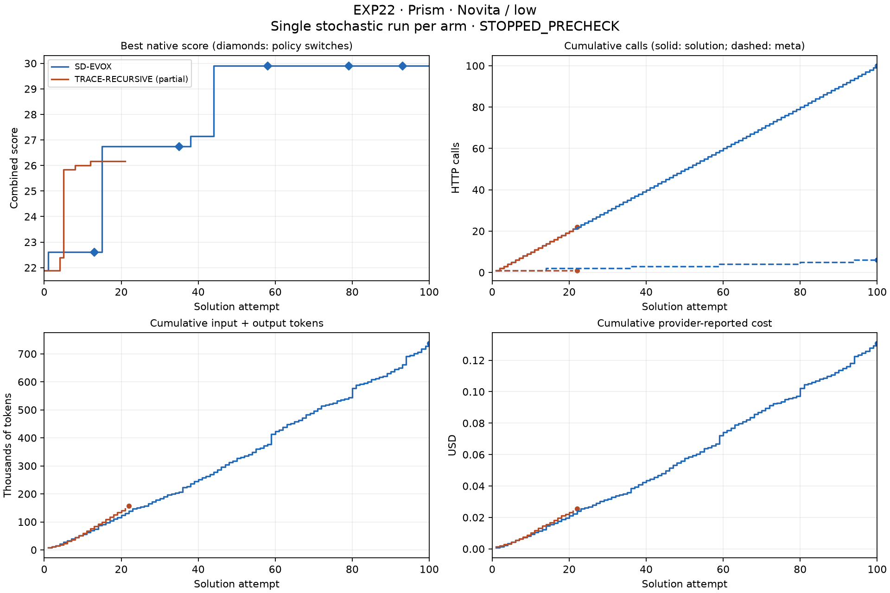

STATUS: STOPPED_PRECHECK

FACT: Execution stopped because the stock evaluator reported a 360-second timeout while its candidate worker continued running. Candidate 21 completed evaluation while that earlier worker was still CPU-active, violating the required sequential execution. The owned process was cancelled; all HTTP evidence was flushed before its remaining worker was terminated. This is an execution-validity failure, not a negative result about Trace meta-optimization.

MEASURED RESULT: PRISM SD-EVOX completed 100 attempts. PRISM TRACE-RECURSIVE recorded 21 outcomes and 22 solution HTTP calls; the last returned call was interrupted before evaluation. Its raw `final_result.json` is preserved, with explicitly hashed recovery metadata for the best source and metrics. The best source first appeared at attempt 12, before the timeout. No strict Trace policy proposal had yet occurred. The six remaining strict runs and the advanced phase did not start.

FACT: A bounded unpaid reproduction in `artifacts/timeout_diagnostic.json` confirms that the stock outer timeout leaves its thread active and permits a subsequent evaluation; PRISM’s inner executor context also waits for its worker after its nominal timeout. Every reproduction worker was released and joined. No frozen runtime source or source repository was patched after strict execution started.

LIMITATION: The full timed-out candidate was not retained: stock retry prompts truncate failed source. Its surviving excerpt is labelled accordingly. The interrupted Trace run has no completed canonical control-plane result or comparable normal kernel wall-time measurement. No missing artifact is represented as a successful result.

FACT: All low-effort S0–S5 gates passed before strict execution. Two independent SkyDiscover PRISM checks and one Trace check returned valid code with 886–996 completion tokens (51–74 reasoning tokens). The two earlier default-reasoning PRISM calls each exhausted 32,000 completion tokens without code. Their evidence is archived separately.

FACT: The fixed route is `z-ai/glm-5.3-flash` through OpenRouter, provider `novita`, reasoning effort `low`, session `benchmark-PRIMS-SIGNAL-run-001`, temperature 0.7, maximum 32,000 tokens and timeout 600 seconds. Trace uses CP-A: exact transport with a nonportable, nonpromotable control-plane override. CP-B was excluded because its empty-response fallback changes the token ceiling.

MEASURED RESULT: Eight five-attempt pilots passed. Trace PRISM deployed two generated policies while retaining its population. A Signal Trace S4 diff-format failure is preserved alongside its successful bounded retry. Pilots are excluded from strict quality comparisons.

MEASURED RESULT: Strict runs below start from the stock initial solution and consume up to 100 solution HTTP attempts. Partial runs have no 100-attempt AUC and are excluded from contrasts.

| Task | Arm | Attempts | Initial | Final best | Gain | Relative gain | AUC / 100 | First / best iteration | Status |
|---|---|---:|---:|---:|---:|---:|---:|---|---|
| prism | SD-EVOX | 100 | 21.891622 | 29.905794 | 8.0141722 | 0.36608398 | 27.992702 | 1 / 44 | complete |
| prism | TRACE-RECURSIVE | 21 | 21.891622 | 26.160347 | 4.2687246 | 0.19499353 | unmeasured | 4 / 12 | diagnostic stop |

| Task / arm | Valid / invalid | Policy switches | Valid proposals / total | Improving windows | Solution / meta / guide calls | Input / output / cached tokens | Cost USD | Wall seconds |
|---|---|---:|---|---:|---|---|---:|---:|
| prism / SD-EVOX | 58 / 42 | 5 | 5 / 5 | 0.5 | 100 / 6 / 12 | 554227 / 184144 / 5184 | 0.13093798 | 2887.4764 |
| prism / TRACE-RECURSIVE | 14 / 7 | 0 | 0 / 0 | unmeasured | 22 / 1 / 2 | 126274 / 30483 / 0 | 0.02563695 | unmeasured |

MEASURED RESULT: PRISM native components. The stock `max_kvpr` field is inverse mean maximum pressure over successful cases; lower implied pressure is better, but success rate must also be considered.

| Arm | Combined score | Inverse pressure | Implied mean maximum pressure | Success rate |
|---|---:|---:|---:|---:|
| SD-EVOX | 29.905794 | 29.765794 | 0.033595609 | 0.14 |
| TRACE-RECURSIVE | 26.160347 | 25.160347 | 0.03974508 | 1 |

INFERENCE: SD-EVOX’s higher native score came with placement success falling from 100% to 14%; it does not establish better placement reliability. The partial Trace best retained 100% success, but unequal budgets and the execution stop prevent an optimizer comparison. `artifacts/best_solution_rechecks.json` records separate sequential stock-evaluator checks of both saved best sources.

MEASURED RESULT: Signal Processing native components.

| Arm | combined_score | composite_score | correlation | noise_reduction | slope_changes | lag_error | success_rate |
|---|---:|---:|---:|---:|---:|---:|---:|
| No strict Signal run executed | unmeasured | unmeasured | unmeasured | unmeasured | unmeasured | unmeasured | unmeasured |

MEASURED RESULT: Completed strict contrasts only. Positive score differences favor the first arm.

| Task | Contrast | Final score difference | Relative-gain difference | AUC difference |
|---|---|---:|---:|---:|
| Unmeasured | No completed strict pair | unmeasured | unmeasured | unmeasured |

INFERENCE: The strict matrix is incomplete. The unrun within-framework contrasts cannot establish whether Trace or EvoX improves over its fixed policy, or whether Trace matches EvoX at equal budget.

INFERENCE: Advanced phase is not authorized by the current evidence gate. It has not run; no additional-freedom benefit has been measured.

LIMITATION: This is a controlled single-run benchmark, not a statistical replication. No p-values are computed. Equal solution attempts do not equal total compute. The shared session and sequential run order can affect cache, latency and cost. Costs are provider-reported; calls with missing cost are not treated as free. Exact evaluator invocation counts were not separately instrumented; candidate counts cannot recover evaluator retries or cascaded stage calls.

MEASURED RESULT: Entire current low-effort series, including diagnostics and pilots: 248 completion requests, 1357844 reported tokens, $0.22011441 reported cost; 0 calls have unknown cost. Historical DeepInfra and default-reasoning Novita evidence is excluded.

FACT: Detailed curves, role accounting, semantic retries, policy validation and per-window gains are in `artifacts/diagnostic_summary.json`. Runtime source hashes are frozen in `artifacts/strict_source_hashes.json`. Each immutable run directory retains source, requests, results and logs.

Validation commands: `experiments/recursive_opt/EXP22/.venv/bin/python -I -m unittest discover -s experiments/recursive_opt/EXP22/tests -v`; `ruff check experiments/recursive_opt/EXP22/src experiments/recursive_opt/EXP22/scripts experiments/recursive_opt/EXP22/tests`; `python3 experiments/recursive_opt/EXP22/scripts/analyze.py`; `python3 experiments/recursive_opt/EXP22/scripts/plot_results.py`. Existing targeted Trace tests: 162 passed, six unrelated integration cases deselected. Credential scan required before publication. Generated stock YAML/log whitespace is preserved as execution evidence.

Diagnostic stop: The stock outer evaluator returned timeout after 360 seconds while candidate worker 20272 stayed CPU-active. Attempt 21 subsequently completed evaluation before that worker stopped, violating sequential evaluation. Last recorded iteration: 21; last valid score: 26.16034671095043. See `artifacts/STOP.json`.

Recommended next experiment: Run unchanged benchmark evaluators inside an owned process boundary with enforceable termination on timeout, prove parity and no surviving workers on both arms, then preregister and rerun strict comparisons from stock initial programs.

Reproduce the timeout diagnosis without paid calls: `experiments/recursive_opt/EXP22/.venv/bin/python -I experiments/recursive_opt/EXP22/scripts/timeout_diagnostic.py`.

FACT: Final validation passed: 32 EXP22 tests, lint, bytecode compilation, unchanged source hashes and frozen runtime, credential scan, saved-source re-evaluation, and visual plot review. No owned benchmark process remains active. Evidence: `artifacts/final_validation.json`.
