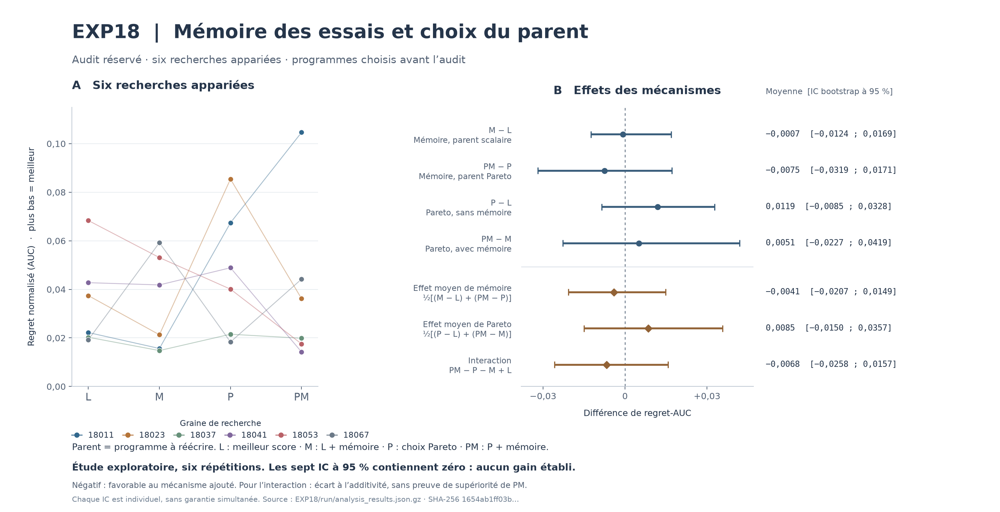

# Figure des mécanismes EXP18

[Aperçu PNG](exp18_mechanisms.png) · [SVG vectoriel](exp18_mechanisms.svg) · [Valeurs exactes et hashes](exp18_mechanisms_provenance.json)



À gauche, les six graines de recherche sont toutes représentées sur l’audit réservé pour L/M/P/PM. Les lignes relient la même répétition entre les bras, sans tri par résultat ni classement moyen. À droite figurent les quatre contrastes simples enregistrés et les trois effets factoriels, avec leurs intervalles bootstrap appariés à 95 % conservés. Les sept intervalles contiennent zéro. L’étude est exploratoire ; les intervalles individuels n’impliquent pas de garantie simultanée. Un effet simple ou moyen négatif favorise le mécanisme ajouté. Une interaction négative désigne un écart à l’additivité et ne prouve pas la supériorité de PM.

La légende définit le parent comme le programme remis au modèle pour être réécrit. L choisit le meilleur score d’apprentissage agrégé ; M ajoute l’archive des essais ; P choisit parmi les parents non dominés ; PM combine ces deux interventions.

Le script lit uniquement `../run/analysis_results.json.gz`. Il n’exécute ni candidat, ni objectif, ni ajustement, ni rééchantillonnage, ni sélection ou analyse scientifique supplémentaire. Il refuse un SHA-256 différent et vérifie la concordance des vecteurs par bras avec les six enregistrements par graine. Ce script de présentation est extérieur à l’implémentation scientifique gelée.

Reproduire depuis la racine du dépôt avec l’environnement existant :

```bash
/tmp/phase0-venv/bin/python artifacts/optimizer_discovery/exp18/figures/render_mechanisms.py
```

L’option `--output-dir /tmp/exp18-figure-reproduction` permet de conserver un export indépendant. L’environnement enregistré est Python 3.13.13 et Matplotlib 3.11.0 ; aucune dépendance n’a été installée. Les dates des métadonnées SVG sont omises et le sel des identifiants SVG est fixé. Le second rendu français produit des PNG, SVG et JSON de provenance identiques octet par octet.

Validation : les 24 points et les sept enregistrements complets de contraste concordent exactement avec l’analyse conservée. Les nombres affichés sont arrondis à quatre décimales, avec virgule française. Le PNG a été contrôlé visuellement : textes, appariement, extrémités des intervalles, ligne zéro et notes. Un premier rendu avait une légende superposée au pied de figure ; la présentation a été corrigée. Ruff format/check passe. Les preuves scientifiques n’ont pas été modifiées.

| Artefact | SHA-256 |
|---|---|
| `../run/analysis_results.json.gz` | `1654ab1ff03bf1d2713bb3ec6bfe870f603cc8ae6e77b32579a074d20f94925a` |
| `render_mechanisms.py` | `86f24f19fb2ab8e8b15d123ca41e11aa8e7f5633a20ee3e7fa93befc491301ef` |
| `exp18_mechanisms.svg` | `05958451b20e39e9a46b7f7ea6f9e53ac5640ee2f11f8fbb4a082c769c5d79c7` |
| `exp18_mechanisms.png` | `4f13b0b3f8cac847b0cbfb90ebecc200b7f18561e020ffc2248511e6f1f9657b` |
| `exp18_mechanisms_provenance.json` | `0314092eae6af07dacd55bac26722f9652691b251f6ecb92d926c888c0899997` |
