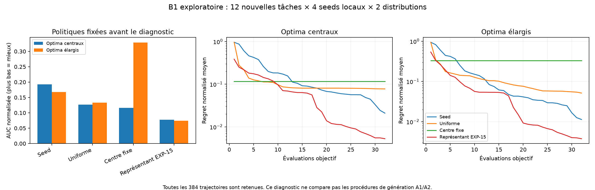

# B1 : prior central, initialisation et surface optimisable

Le prior central favorise effectivement une politique qui propose toujours le
centre. Mais le benchmark possède aussi une marge exploitable par une politique
adaptative : le représentant EXP-15 choisi sur validation obtient une meilleure
AUC moyenne et un meilleur regret final sur les deux distributions nouvelles.
**Cette expérience compare quatre programmes fixés, pas les procédures A1/A2.**
Elle ne prouve donc pas que le feedback récursif est la cause de cette amélioration.

Le protocole a été écrit dans `PROTOCOL_B1.md` avant le lancement, puis les sources,
tâches, seeds et constantes ont été figées dans `freeze.json`. Douze instances
nouvelles, équilibrées sur six strates, sont évaluées avec quatre seeds locaux
communs et deux positions appariées des optima. Les positions centrales [-2,2]
sont multipliées par 2,25 pour la condition élargie [-4,5,4,5]. Les autres
paramètres et les bornes [-5,5] sont identiques. B=32 dans tous les cas.

## Résultats complets

Chaque ligne agrège les **48 trajectoires** prévues. Les 384 trajectoires sont
valides ; aucun timeout, aucune exception de candidat, aucun fallback. AUC et
regret final : plus bas = mieux. Cible : regret normalisé ≤0,01.

| Distribution | Politique | AUC | Regret final | Atteinte de cible | Temps à cible plafonné/censuré |
|---|---|---:|---:|---:|---:|
| Centrale | Seed | 0,192300 | 0,020946 | 60,42 % | 21,979 |
| Centrale | Uniforme | 0,126487 | 0,077503 | 16,67 % | 28,667 |
| Centrale | Centre fixe | 0,116087 | 0,116087 | 16,67 % | 27,667 |
| Centrale | Représentant EXP-15 | **0,077615** | **0,005263** | **85,42 %** | **17,250** |
| Élargie | Seed | 0,167906 | 0,011340 | 70,83 % | 21,146 |
| Élargie | Uniforme | 0,132926 | 0,051511 | 50,00 % | 25,250 |
| Élargie | Centre fixe | 0,328791 | 0,328791 | 8,33 % | 30,333 |
| Élargie | Représentant EXP-15 | **0,074297** | **0,003773** | **89,58 %** | **15,167** |

Le temps à cible vaut 33 par convention pour une non-atteinte : ce n'est pas un
temps observé. Les valeurs brutes conservent `target_evaluations: null`.



Version exportable : `headroom.pdf`. Les courbes utilisent une échelle verticale
logarithmique ; aucun regret n'est tronqué ou limité à 1.

## Ce qui est établi par l'intervention

**1. Le centre est un prior utile sur cette distribution, pas un bon optimiseur
universel.** Son AUC est inférieure à celle du seed sur la condition centrale,
puis devient la pire des quatre en élargissant les positions des optima. Une
bonne valeur au début peut donc masquer l'absence totale d'adaptation. Le centre
reste un contrôle diagnostique important ; il ne constitue pas le seed conseillé.

**2. La surface n'est pas saturée et l'absence générale de headroom est rejetée
pour ces instances.** Le représentant adaptatif domine les trois contrôles sur
l'AUC moyenne dans les deux conditions. Sur l'élargie il a la meilleure AUC dans
chacune des six strates ; sur la centrale, le centre fixe gagne la strate Sphere/4
(0,095328 contre 0,262952). Les familles/dimensions ne sont donc pas interchangeables.

**3. L'AUC et la qualité terminale peuvent classer différemment les politiques.**
Sur la condition centrale, l'uniforme bat le seed en AUC (0,126487 contre
0,192300), mais son regret final est 3,70 fois plus élevé et il atteint la cible
beaucoup moins souvent. Les deux mesures décrivent des objectifs différents :
rapidité d'amélioration sur toute la trajectoire, et qualité après 32 appels.
Ce n'est pas un défaut arithmétique d'EXP-15. Cela demande de préciser quelle
forme de gain intéresse l'utilisateur avant une prochaine confirmation.

**4. Le début de trajectoire pèse lourd dans l'AUC.** La moyenne de la fraction
de chaque AUC provenant des quatre premières évaluations vaut 50,89 % pour le
seed central ; les huit premières représentent 68,84 %. Pour le représentant,
ces parts sont 48,71 % et 70,51 %. Sur la distribution élargie, elles valent
respectivement 57,51 %/76,49 % pour le seed et 63,92 %/79,39 % pour le représentant.
La somme est bien celle des regrets best-so-far, pas celle des valeurs proposées
isolément. Il existe donc un levier important sur l'initialisation, en plus de
l'amélioration conditionnée par une longue histoire.

## Variabilité et limites

Les AUC appariées par seed local montrent que le résultat moyen ne vaut pas pour
tous les tirages :

| Seed local | Seed, central | Représentant, central | Seed, élargi | Représentant, élargi |
|---:|---:|---:|---:|---:|
| 16201 | 0,296440 | 0,076258 | 0,269486 | 0,071175 |
| 16202 | 0,126522 | 0,076611 | 0,075266 | 0,070802 |
| 16203 | 0,293248 | 0,069507 | 0,255183 | 0,069585 |
| 16204 | **0,052990** | 0,088084 | **0,071687** | 0,085625 |

Ces quatre seeds ne sont pas des réplications de la génération LLM. Les deux
transformations partagent les mêmes instances latentes ; les 384 trajectoires
ne sont pas 384 réplications indépendantes d'une hypothèse sur A2 versus A1.
Le représentant est celui choisi par validation dans EXP-15, avant B1 ; il
n'a été ni choisi ni modifié après observation de B1.

La normalisation est celle d'EXP-15 : moyenne de 128 points uniformes par tâche.
Élargir les shifts change aussi la constante et sa seed de référence. Les
comparaisons entre politiques dans une même tâche restent équitables. Une
différence absolue d'AUC entre les distributions n'isole pas exclusivement un
changement de difficulté physique : les échelles ont également changé.

## Modifications que ce diagnostic justifie de tester

- Conserver les contrôles uniforme et centre fixe dans les pilotes de headroom.
  Rapporter les six strates, la qualité terminale et les courbes anytime ensemble.
- Tester prospectivement une **initialisation commune**, puis la performance
  d'adaptation sur les appels restants, si la question est la valeur du feedback
  sur une histoire déjà informative. Garder aussi l'AUC complète pour quantifier
  le coût réel de l'initialisation. B1 ne mesure pas encore l'effet de ce changement.
- Tester la stabilité de sélection avec plusieurs seeds locaux et plusieurs
  instances par strate, avant de consacrer le budget à davantage de propositions.
  B1 montre de la sensibilité au seed ; il ne chiffre pas le panel optimal.
- Élargir ou diversifier les positions des optima seulement si cela correspond à
  la tâche scientifique souhaitée. Ne pas choisir cette distribution au motif
  qu'elle arrange un artefact A2 déjà observé. Une nouvelle confirmation exige
  d'autres instances, d'autres seeds et un protocole gelé avant les résultats.

**Aucun pourcentage de gain futur du feedback récursif n'est projeté à partir de
B1.** Le résultat borne le diagnostic : on ne peut pas expliquer le contraste
EXP-15 inconclusif uniquement par une surface plate, et on ne peut pas attribuer
les progrès d'AUC uniquement à une meilleure adaptation tardive.

## Ressources, intégrité et commandes

- 12288/12288 appels objectif alloués effectivement consommés ; aucun abandonné.
- 24576 lancements subprocess pour proposition + replay déterministe.
- 1285,32 s cumulées d'exécution ; 644,6 s observées avec deux workers.
- 3072 évaluations de référence initiales et 3072 supplémentaires lors de la
  reconstitution d'intégrité dans un nouveau processus ; elles ne sont pas des
  appels alloués aux politiques. Aucun appel modèle, aucun coût provider.
- Hash du gel : `bcac12ac1da459cffa1dc69b8a0cfc024bd8614a02f1812bf52324cec1e5b8c1`.
- Représentant exact :
  `1684f91acdc36c0ca6aac70afeb9cc2c4eed7ab847926d5880590e059266abb7`.
- Tous les scores, observations, seeds, statuts et hashes sont dans `raw/`.
  `results.json` contient tous les groupes, seeds locaux et strates ; la
  reconstitution complète depuis les 384 fichiers bruts produit le même résultat.

```bash
/tmp/phase0-venv/bin/python -m pytest -q tests/unit_tests/test_investigation16_history.py tests/unit_tests/test_investigation16_benchmark.py
/tmp/phase0-venv/bin/python -m artifacts.optimizer_discovery.investigation16.benchmark.headroom run
/tmp/phase0-venv/bin/python -m artifacts.optimizer_discovery.investigation16.benchmark.headroom analyze
/tmp/phase0-venv/bin/python -m artifacts.optimizer_discovery.investigation16.benchmark.plot
```

Tests : **6 passés en 2,02 s**, dont 3 pour B1, après échec initial attendu à
l'import du module absent. Black/Ruff passent sur les trois scripts de cette
enquête et leurs deux fichiers de tests. La figure PNG a été inspectée visuellement.
