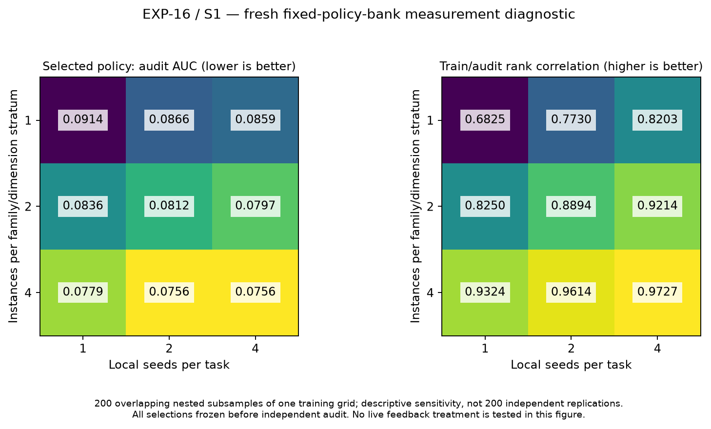

# EXP-16 / S1 — measurement design changes policy selection on fresh tasks

**Complete exploratory fixed-bank diagnostic.** Increasing the diversity and
replication of training evaluations improved selection on this new benchmark
panel. This isolates a measurement-design mechanism; it does **not** test whether
live recursive feedback beats independent LLM generation.

The [protocol](PROTOCOL_S1.md), exact [freeze](freeze.json), and eleven source
artifacts were preserved before S1 evaluation. Freeze SHA256:
`a6968c4665e6c43abec0d653c70675cfca99970e848c63bdf95a633e2a3c40f4`.
All task semantics match EXP-15, but 24 training and 12 audit instances are new,
balanced across Sphere/Quadratic/Rosenbrock × dimensions2/4. Four local-seed blocks
16101–16104 are separately derived for every task. Source policies are the exact
unique old validation selections plus the original seed, midpoint and uniform.
Neither the bank nor the evaluation design was chosen using S1 outcomes.

## Independent-audit results of the frozen selection procedures

Lower normalized anytime regret-AUC is better. Each cell averages the independent
audit performance of policies selected using200 preregistered, nested training
subsamples. Those subsamples overlap within one finite grid and are **not200
independent scientific replications**. The table contains descriptive sensitivity,
not population confidence intervals. All1,800 choices were frozen before the first
audit trajectory began.

| Training task instances | Local seeds/task | Training trajectories/policy | Selected-policy mean audit AUC | Excess above best audit policy in fixed bank | Mean train/audit Spearman |
|---:|---:|---:|---:|---:|---:|
| 6 | 1 | 6 | .091412 | .015846 | .683 |
| 6 | 2 | 12 | .086625 | .011059 | .773 |
| 6 | 4 | 24 | .085921 | .010355 | .820 |
| 12 | 1 | 12 | .083565 | .007999 | .825 |
| 12 | 2 | 24 | .081151 | .005585 | .889 |
| 12 | 4 | 48 | .079652 | .004087 | .921 |
| 24 | 1 | 24 | .077907 | .002341 | .932 |
| 24 | 2 | 48 | .075566 | .000000 | .961 |
| 24 | 4 | 96 | .075566 | .000000 | .973 |

Each trajectory costs32 objective calls. At equal cost of24 trajectories or768
objective calls per policy, **24 tasks×1 local seed** (.077907) beats **12×2**
(.081151), which beats **6×4** (.085921) in this diagnostic. Thus the evidence does
not support spending all additional evaluation budget on repeated local seeds.
Compared with6×4,24×1 reduces selected-policy audit AUC by .008014 (9.3%), and
reduces excess above the finite-bank reference by77.4%. At the smaller equal cost
of12 trajectories,12×1 (.083565) also beats6×2 (.086625).

Relative to6×1,12×2 lowers mean selected-policy audit AUC by .010261 (11.2%), and
24×2 lowers it by .015846 (17.3%). These are **observed fixed-bank selection gains**,
not predicted feedback-treatment gains, and they must not be advertised as future
percentage improvements in recursive_opt. Larger panels expose more information
about policies already available; they do not generate new policies.

The best finite-bank audit value .075566 is an empirical reference computed after
selection. It is not an unknown population optimum. With24×2, all200 training
subsamples select the old validation representative A2/41, which also happens to
have the smallest audit mean. With6×1, only48/200 select it;37 choose midpoint,
45 choose A2/53, and the remaining70 choose one of four A1 programs. Neither the
trusted seed nor uniform is selected in any of1,800 decisions. The zero excess at
24×2/24×4 refers to this fixed audit bank, not an assertion of perfect selection
in new populations. For24×4, all200 training panels are identical by construction.



## What generalizes in this source bank

| Bank index | Policy provenance | Mean audit AUC |
|---:|---|---:|
| 0 | unchanged seed | .162685 |
| 1 | EXP-15 A1/11 | .109876 |
| 2 | EXP-15 A1/23 | .126010 |
| 3 | EXP-15 A2/23 | .129550 |
| 4 | EXP-15 A1/37 | .109392 |
| 5 | EXP-15 A1/41 | .080689 |
| 6 | EXP-15 A2/41, old validation representative | **.075566** |
| 7 | EXP-15 A1/53 | .136265 |
| 8 | EXP-15 A2/53 | .079901 |
| 9 | always midpoint | .102004 |
| 10 | uniform | .165726 |

The previously validation-selected A2/41 artifact transfers to new instances and
local seeds, and its .075566 mean is below midpoint's .102004. That confirms usable
headroom beyond pure midpoint initialization for this benchmark. A1/41 also reaches
.080689, so this is not evidence that only feedback can produce a useful program.
The bank is a selected collection of old artifacts, not five new paired search runs;
comparing the best A2 and best A1 bank member cannot replace H15-B.

Representative source is preserved unchanged at
[sources/1684f91a….py.gz](sources/1684f91acdc36c0ca6aac70afeb9cc2c4eed7ab847926d5880590e059266abb7.py.gz),
exact source SHA256
`1684f91acdc36c0ca6aac70afeb9cc2c4eed7ab847926d5880590e059266abb7`.
The freeze lists every other exact source hash, compressed path and provenance.

## Why more instances help more than only local repeats here

The unchanged seed has mean within-task local variance .012972 across strata,
versus a raw estimated between-instance component .000846. That corroborates the
large local randomness seen retrospectively in EXP-15. However, better bank
policies exhibit a different decomposition:

| Policy | Mean within-task local variance | Raw between-instance component |
|---|---:|---:|
| A0 seed | .012972 | .000846 |
| A1/41 | .000418 | .005271 |
| A2/41 | .001263 | .002185 |
| A2/53 | .001031 | .004796 |
| Midpoint | .000000 | .010477 |

For the strongest available policies, instance variation is larger than local
randomness in this grid. Designing all evaluation replication around the noisy
handwritten seed would therefore miss an important source of error. The variance
components come from only four instances and four local seeds per stratum;
15/66 individual raw task-component estimates are negative and remain negative
in `results.json`, rather than being silently clipped. They are noisy descriptive
estimates, not confidence intervals.

## Implications for the next live pilot

Use a balanced increase in distinct training instances before adding many repeats.
At a strict24-trajectory evaluation budget,24×1 performed best in this bank;
12×2 provides local replication but has a measured selection-quality tradeoff.
If48 trajectories per candidate are affordable,24×2 is the strongest measured
compromise: it matches24×4's selected policy at half its objective-call cost.
Do not describe12×2 as empirically optimal; its practical appeal is a smaller
task panel plus explicit local replication, which needs a prompt/latency feasibility
check. Information shown to the LLM can be a bounded summary of the larger panel.

These findings justify testing24×2 or an explicitly cost-constrained alternative
in a fresh live search pilot. They do not establish that all new candidate lineages
will share this bank's ranking stability, that the optimum panel size is24×2, or
that outer LLM variance will shrink by the same amount. Keep independent generation
and recursive arms on exactly the same larger evaluation allocation.

## Accounting, integrity and verification

- 1,584/1,584 registered trajectories completed;50,688 actual objective calls,
  zero unused objective allocations;101,376 subprocess executions.
- Shared preparation:4,608 reference objective calls, separately accounted.
- 0/1,056 train candidate failures;0/528 audit candidate failures;0/528 audit
  fallback trajectories. No failed or unfavorable outcome was omitted.
- Zero model calls. No candidate source was repaired or manually edited.
- Training elapsed928.864s; audit443.635s, with four offline workers maximum.
  These are machine-specific execution observations, not controlled speed claims.
- Last train completion1788934531441325989ns < selection freeze1788934533319199643ns
  < first audit start1788934533667324929ns.
- All1,800 selections were recomputed from the full raw training grid, every
  selected hash checked, and all1,584 result keys checked against their registered
  source/task/seed/budget identity. Exact results recomputed byte-identically.

[integrity.json](integrity.json) records these checks. Result SHA256:
`115d89866ab95abba7453716b8d6a768bd43cc2c46b3321727445b740aacd4f4`.
Recompute with:

```bash
/tmp/phase0-venv/bin/python -m artifacts.optimizer_discovery.investigation16.selection.run analyze
/tmp/phase0-venv/bin/python -m pytest -q artifacts/optimizer_discovery/investigation16/statistics/test_audit.py artifacts/optimizer_discovery/investigation16/selection/test_selection.py
```

The combined diagnostic tests report11 passed. Black and Ruff pass for the
implementation, tests and plotting helper. The plot was rendered and visually
checked; a footer overlap was corrected in the presentation helper without
changing frozen analysis or scientific values. There were no S1 scientific
amendments, semantic defects, invalidations or reruns of completed trajectories.

The broader affected command, adding
`tests/unit_tests/test_recursive_optimizer_benchmark.py` and
`tests/unit_tests/test_recursive_optimizer_program.py` to the two diagnostic modules,
reports49 passed in8.38s, with no skips or exclusions in that command.
